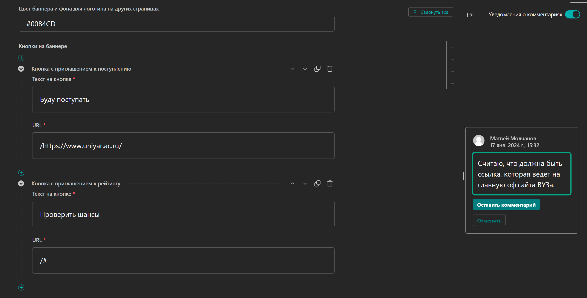
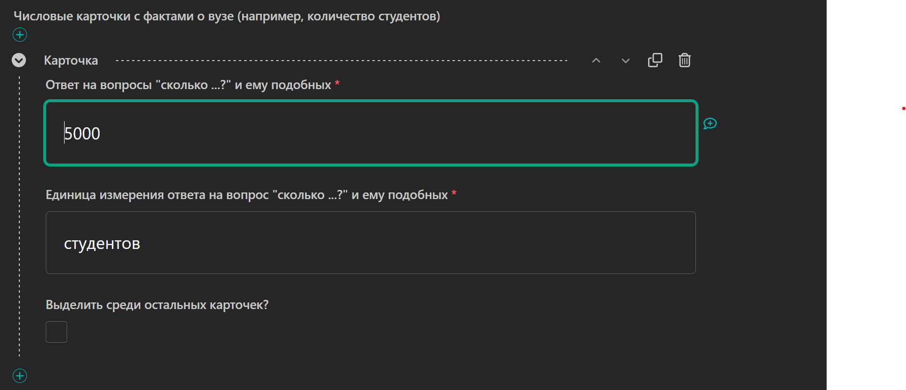
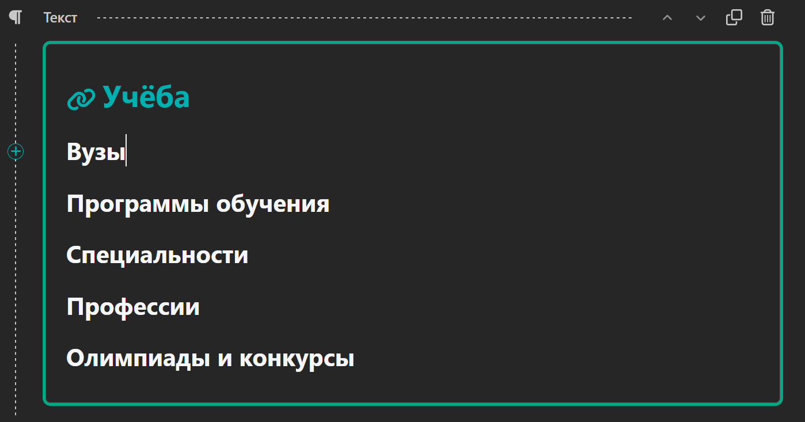

= *User experience*

=== Раздел УЧЕБА (STUDY)

Начал я заполнять карточки университетов. Коротко и субъективно: очень удобно.

Из предложений:

. Две кнопки для главной карточки ВУЗа.
+
image::./pictures/1.png[100%,align="center"]
+
Если первая кнопка, по моей логике, ведет на *Тест*, то вторая должна вести либо:
+
* на главную страницу сайта ВУЗа.
* на подвал страницы ВУЗа, где располагаются контакты.
+

. Удобная работа с изображениями, особенно радует выбор фокусной точки.
+

. Удобно оставлять комментарии, которые пригодятся и коллегам, и самому редактору.
+

. Удобно добавлять блок как сверху, так и снизу, через ⊕.
+

. Удобная менюшка с добавлением блока.
+

.  Удобно работать с ссылками различного типа.
+

.  Немного магии на примере блока "Контакты" для ВУЗа.
+
Довольно длинный домен у ЯрГУ, в адресе также указан индекс. Происходит перенос элементов "на вторую строку".
+

+
Добавим немножко магии и получим результат, соответствующий макету.
+

+
Магия заключается в том, что блок поддерживает многострочный текст и его можно удобно "подгонять" при необходимости - мастхэв!
+
image::./pictures/10.png[100%,align="center"]

. *Вот тут хотелось бы обратить внимание:*
+
Все же, вторая строка, предназначена для текстового описания того числа, которое указано в первой строке. Единицы измерения пусть указывают рядом с количественным элементом в первой строке, а вторую строку оставим для описания.
+
Если мы заполним вот так,
+

+
то получим:
+

+
И если в данном случае это сработало неплохо, то для второго блока предлагаю делать так:
+

image::./pictures/14.png[100%,align="center"]
+
И поправить описание блоков в админ-панели на что-то типа:
+
* "Количественный элемент и спец символы типа (%, + и т.п.)" - 1 строка
+
* "Краткое текстовое описание элемента из первой строки" - 2 строка
+
В стандартизированных карточках можно оставить в текущем виде, ибо там все же этот стандарт должен работать :) 
+

. Неразрывный пробел
+
Согласно требованию заказчика, хотят, чтобы часть из названия ВУЗа по типу "им К.Д. Ушинского" была неразделима, просят сделать перенос строки.
+

+
Мы сделали неразрывным пробелом во всех подобных местах + в аббревиатурах. Описание есть https://github.com/veck-messel/student76/issues/62#issuecomment-1905675920[тут].
+
*Результат:*
+

. Проблема с ЯГМУ: 
+
ЯГМУ вообще выделились ответом на запрашиваемую инфу и прислали презентацию powerpoint, информацию пришлось собирать по крупицам самому.
+
Они вполне справедливо указали нижнюю планку стоимости, которая не влезает в нашу карточку. Как бы это изящности обойти? - я не придумал с ходу.
+

. Хотите кратко? - будет кратко.
+
Исходя из документа, который прислал заказчик, хотят получить такой результат:
+
image::./pictures/21.png[100%,align="center"]
+
Окей, сделаем другой заголовок страницы, хоть и до этого, как по мне, выглядело лучше.
+

. Кнопки с ссылками на соцсети
+
У топ-3 (моего личного рейтинга), безусловно, есть и ВК, и ТГ, помимо других медиа-ресурсов. У ВУЗов "попроще" не всегда есть есть телеграм-канал, а вместо него может быть ссылка на ОК (прости Господи) - кейс ЯГАУ или YouTube-канал - кейс ЯГТИ. Видел и Дзен у некоторых - пример, ЯрГУ. Считаю, что нужно предусмотреть такую возможность на будущее.
+
Хотя бы добавить в чеклист предложений по усовершенствованию сайта при дальнейшем (оплачиваемом) сотрудничестве.
+

. Uppercase для ВУЗов
+
Безусловно, приятная функция, что не нужно вбивать капсом в Заглавии страницы "Название вуза" (пикча выше). Тем более, на странице "Учёба", верхний регистр не используется. Но есть и моменты, когда буквально одна буква, должна быть в нижнем регистре. Примеры ниже:
+
image::./pictures/21.png[100%,align="center"]

+
Могут попросить (как было с  использованием официальных названий ВУЗов) все же дать возможность сделать "по канону": ЯрГУ и МУБиНТ, к примеру - имеем это ввиду.

. Как отредактировать footer и header (подвал и шапку)
+
В левой панели есть раздел *"Фрагменты"*
+

. Панель форматирования текста
+
Скорее всего, панель имеет такой вид:
+

+
Один из вариантов форматирования предполагает, что у вас стоит курсор в каком-то поле текста. Тогда слева появится значок ⊕ напротив курсора.
+

+
Нажав на этот значок появится раскрывающийся список
+

+
Другой вариант предполагает выделение текста, который необходимо форматировать
+

+
Чтобы закрепить эту панель для всех доступных текстовых полей, нужно нажать на кнопку в правом верхнем углу
+

+
Панель будет закреплена для всех блоков, открепить ее можно обратным действием
+

